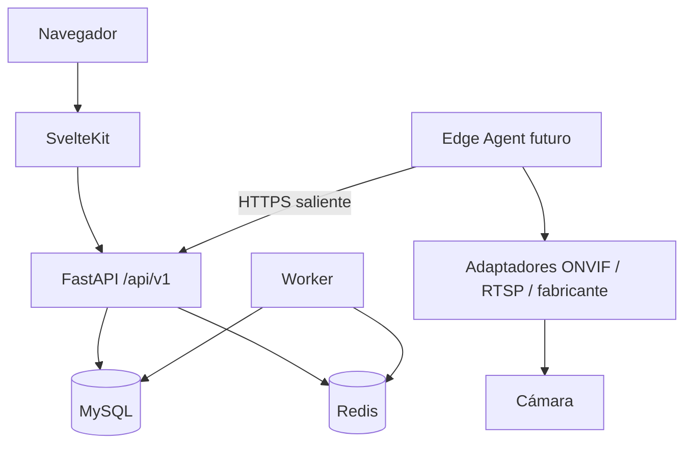
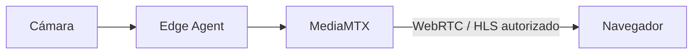

# Vigilay — arquitectura

## Decisiones

Monorepo en la raíz existente. FastAPI y SQLAlchemy 2 para el control plane; MySQL 8.4 UTF8MB4 como persistencia y Alembic para versiones. Se usa SQLAlchemy síncrono y PyMySQL: los endpoints de trabajo bloqueante ejecutan en el threadpool de FastAPI, simplificando transacciones y pruebas en Windows. Redis para coordinación/heartbeat de workers. SvelteKit, TypeScript y adapter-node para web. Python para adaptadores y futuro Edge Agent, manteniendo la reutilización de OpenCV/YOLO.

Sesiones opacas revocables con hash en base de datos y cookies HttpOnly; Argon2id para contraseñas. CSRF ligado criptográficamente a la sesión más comprobación de Origin en escrituras del navegador. No hay credenciales predeterminadas. El primer superadministrador se crea mediante CLI interactiva. AES-256-GCM para secretos de cámara, usando tenant e identificador de cámara como datos autenticados.

El repositorio de datos impone contexto explícito: tenant para clientes, contexto global únicamente para superadministrador y procesos internos. Un hook ORM aplica el filtro a SELECT; la unidad de trabajo rechaza escrituras fuera del contexto y operaciones SQL masivas. Las referencias entre sedes y cámaras llevan claves compuestas con tenant. Los permisos se comprueban en el backend.

La migración inicial cubre identidad y administración; las entidades de cada nueva fase se incorporan con migraciones nuevas, evitando declarar completas funciones por tener tablas vacías. El simulador tiene identificación explícita y nunca verifica compatibilidad de marcas reales.

## Topología de medios prevista

La web nunca recibirá URLs RTSP ni secretos. El gateway incluido en Compose permanece en red interna hasta implementar autorización de sesiones. El control plane no abre conexiones a direcciones de cámara suministradas por clientes. Las integraciones Imou/EZVIZ, el descubrimiento ONVIF y el despliegue Bunny requieren fases específicas de implementación y verificación; no se inventan endpoints.

## Referencias técnicas

- [FastAPI: hashing y seguridad](https://fastapi.tiangolo.com/tutorial/security/oauth2-jwt/).
- [SQLAlchemy: criterios globales para control de acceso](https://docs.sqlalchemy.org/en/20/orm/queryguide/api.html#sqlalchemy.orm.with_loader_criteria).
- [SvelteKit adapter-node](https://svelte.dev/docs/kit/adapter-node).
